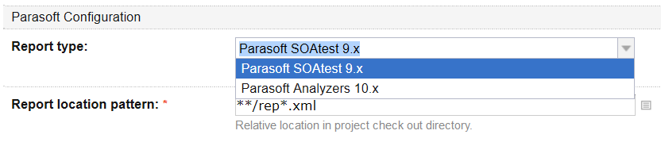
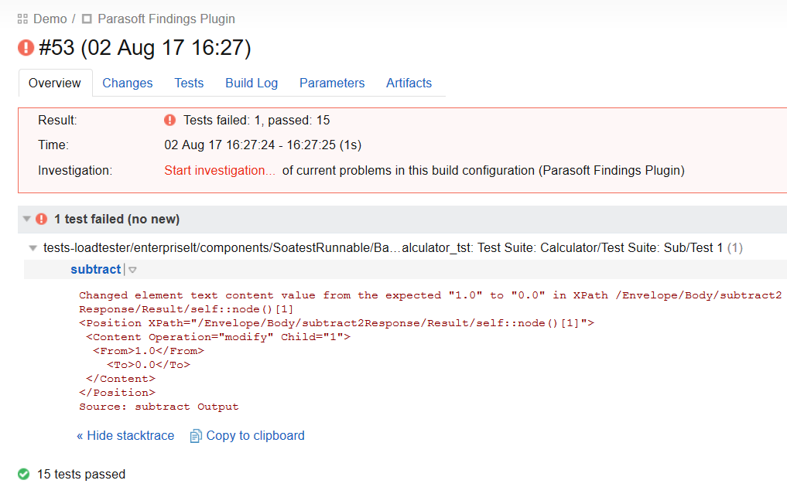
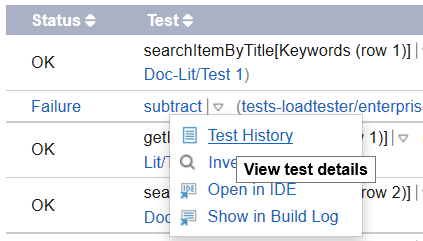

# Parasoft Findings for TeamCity

The Parasoft Findings plugin is designed to be used in a post test-execution build step that integrates functional and unit test reports generated by Parasoft tools into your Team City project. The task will collect test results from the Parasoft report XML files and display the number of passed/failed tests and result details. The results can also be displayed as trending data in a graph for a simple visualization.

The plugin can consume the following report types:

* Parasoft SOAtest 9.x XML reports.
* Parasoft Analyzers 10.x XML reports generated by Parasoft C/C++test, Jtest and dotTEST tools.

## Requirements

* TeamCity version 2017.1.2 or later.

## Installing the Parasoft Findings Plugin
1. Copy the zip plugin package into the <TeamCity Data Directory>/plugins directory.
2. Restart the TeamCity server.

See TeamCity Installing Additional Plugins documentation page for additional information.

## Configuring the Plug-in

1. In the build configuration page, choose *Build Steps* and click *Add build step*. 
2. Choose *Parasoft Findings* from the *Runner type* drop-down menu.
3. Specify a name for the step (optional) and choose an execution step policy form the Execute step drop-down menu (see the [TeamCity documentation](https://confluence.jetbrains.com/display/TCD10/Configuring+Build+Steps) for details).
4. In the **Parasoft Configuration** section choose the report type:

5. Review the **Report location pattern** field. The Ant style file selection pattern in this script controls what Parasoft XML report files to include in the TeamCity build report.
6. Click **Save** when finished.
 
## Running the Build

A typical build configuration would consist of the following steps:
1. Clean the build checkout directory. In this step you will clean the Parasoft XML report files left over from the previous build runs. You can configure the following options:
    - Set the *Clean all files in the checkout directory before the build* flag in the *Version Control Settings* of your build configuration.
    - Configure a *Command Line* runner to clean the Parasoft XML report files left over from the previous runs. For instance, you could run the following command to remove all XML files from the build Checkout Directory: rm %system.teamcity.build.checkoutDir%/*.xml
    - Configure the build agent to delete the build Checkout Directory after the completion of the build. To do so, add the following line to the buildAgent.properties file: teamcity.agent.build.checkoutDir.expireHours=0.See the following TeamCity documentation for more details: [Automatic Checkout Directory Cleaning](https://confluence.jetbrains.com/display/TCD10/Build+Checkout+Directory#BuildCheckoutDirectory-AutomaticCheckoutDirectoryCleaning).
2. Run SOAtest, C/C++test, Jtest or dotTEST. This step will generate report files in XML format. The XML report files must be saved in the TeamCity build project Checkout Directory.
3. Run the Parasoft Findings plugin. You can have multiple Parasoft tool runs that would generate multiple XML report files prior to invoking this build step. If the build steps prior to the Parasoft Findings plugin build step generate multiple XML report files all test results from all these files will be added to the TeamCity build results.

## Viewing Results of the Last Build

Open the TeamCity build configuration page and click on the last build results link in the *Overview* or *History* tab. The build results pages contain the appropriate Parasoft tool report details:

The build results page in the **Overview** tab provides the success and error count, as well as error details:

The build results shown in the **Tests** tab will contain the list of all Parasoft tests that ran in the build.

The **Build Log** tab contains logging information in case debugging is needed.

## Viewing Statistics and Trends

Click the **Statistics** tab of the build configuration page to see charts of the historical data for reports generated by Parasoft tools.

To view historical details of a particular Parasoft test, click the menu icon next to the test you are interested in and choose *Test History*. A page with detailed test history will open.

